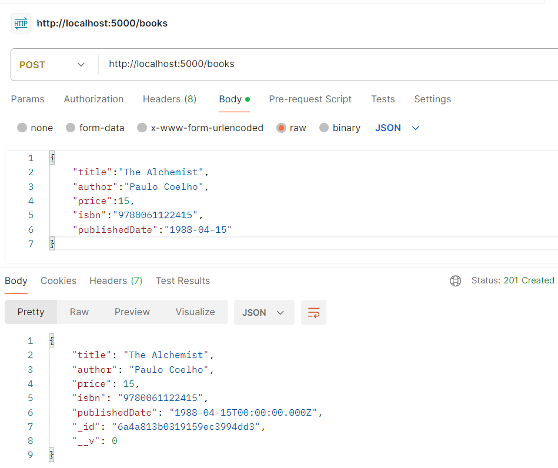
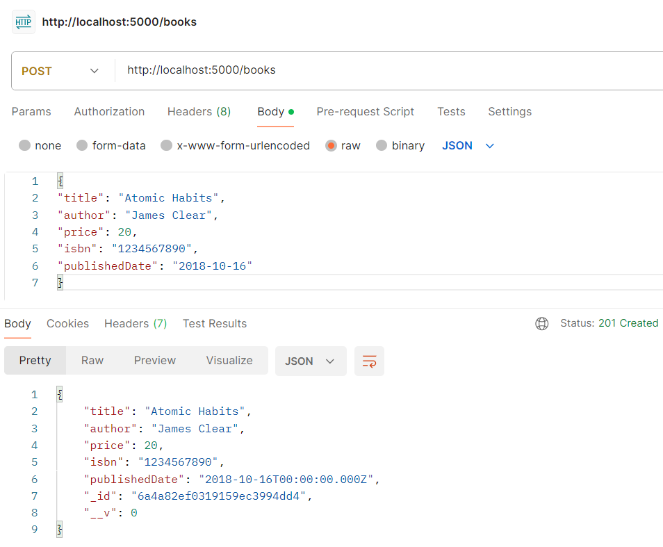
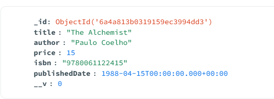
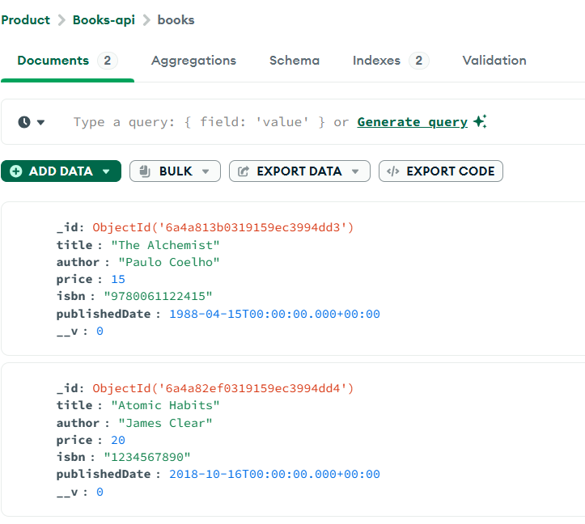
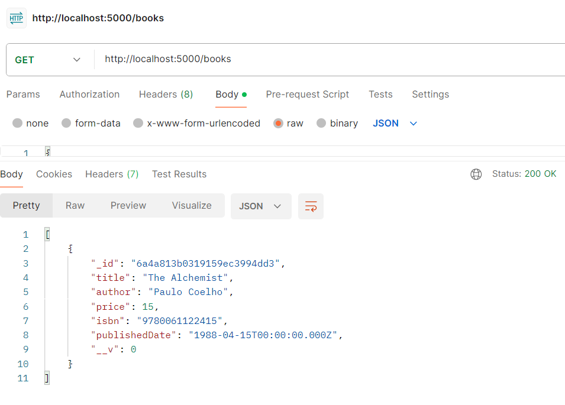
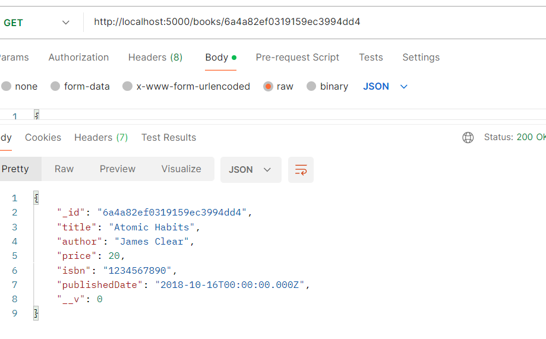
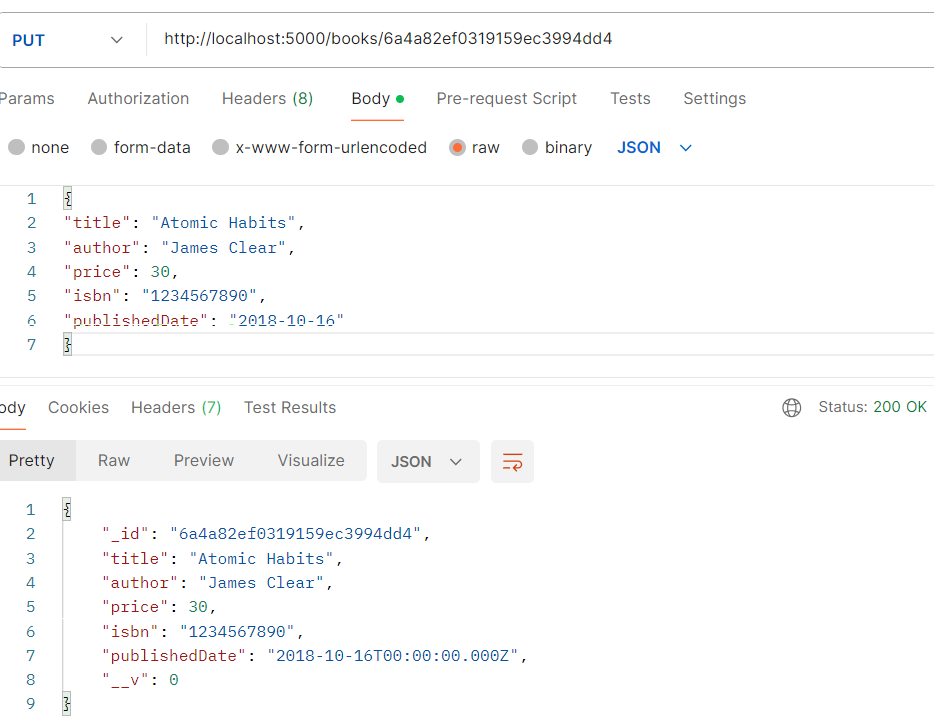
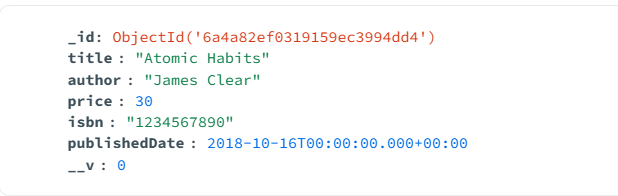
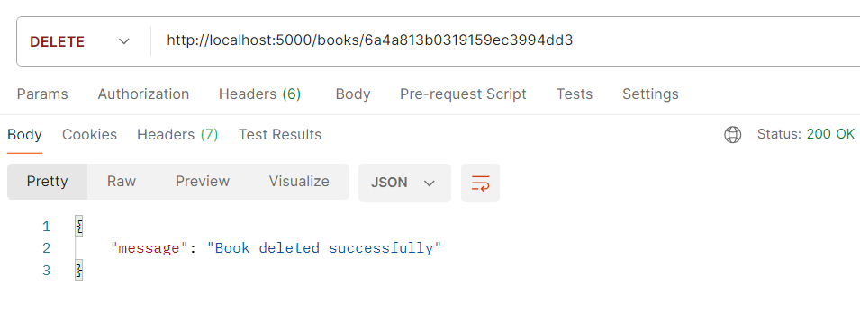
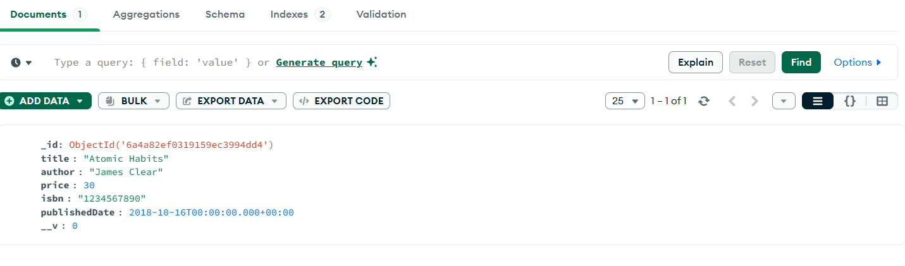

testing the url through postman 

POST http://localhost:5000/books
{
    "title":"The Alchemist",
    "author":"Paulo Coelho",
    "price":15,
    "isbn":"9780061122415",
    "publishedDate":"1988-04-15"
}
{
"title": "Atomic Habits",
"author": "James Clear",
"price": 20,
"isbn": "1234567890",
"publishedDate": "2018-10-16"
}

Postman testing image:

Result in MongoDB collection:

GET http://localhost:5000/books
Results fetched from MongoDB Books collection to postman terminal:

GET BY ID 
http://localhost:5000/books/6a4a82ef0319159ec3994dd4

UPDATE price of book from 20 to 30 
PUT http://localhost:5000/books/6a4a82ef0319159ec3994dd4

updated results in MongoDB Books Collection 

DELETE BOOK by ID
delting "The Alchemist" book using the id 
DELETE http://localhost:5000/books/6a4a813b0319159ec3994dd3

Results in MongoDB collection , only 1 Book remains 
